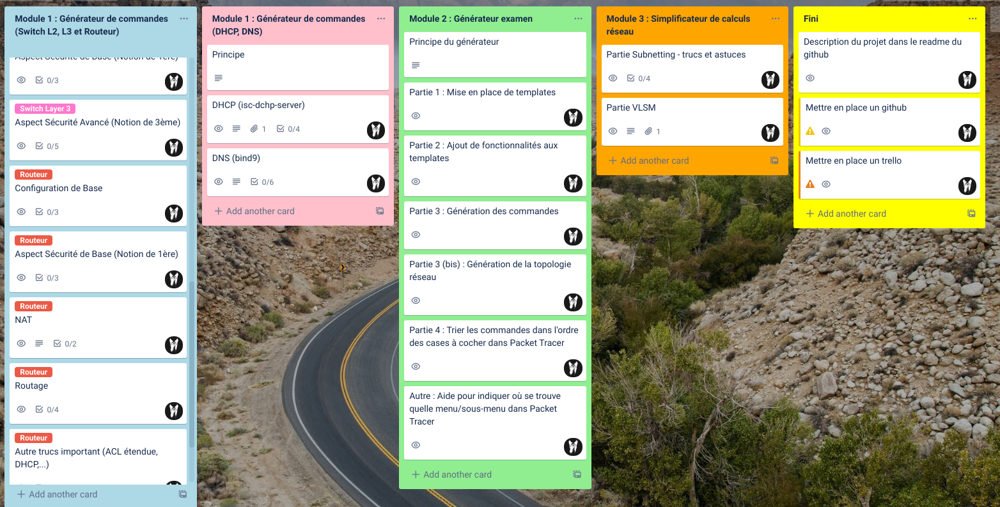
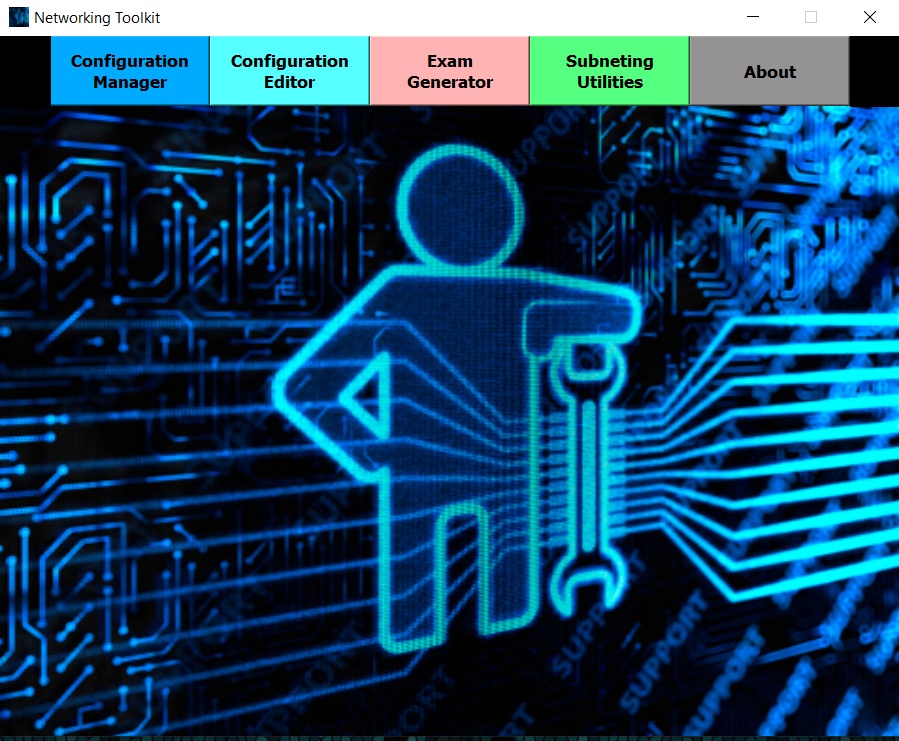

# TFE-Networking_toolkit

* **Coach TFE** : **_Madame Masson_**
* **Etudiant** : **_Morgan Valentin_**

---

## Table des matières

- [Description du projet](#description-du-projet)
- [Objectif du projet](#objectif-du-projet)
- [Division en modules](#division-en-modules)
  * [Premier module](#premier-module)
  * [Second module](#second-module)
  * [Troisieme module](#troisieme-module)
  * [Fonctionnalite bonus](#fonctionnalite-bonus)
- [Aspect technique](#aspect-technique)
- [Organisation et trello](#organisation-et-trello)
- [Workflow git](#workflow-git)
- [Mocup](#mocup)

---

## Description du projet

Application (à but éducative) permettant de faciliter la mise en place d'un réseau ou la génération d'examen via une GUI facile à prendre en main.
Cette application sera divisé en 3 modules :
1. Configuration de divers appareils via un générateur de commandes à "_copier-coller_" dans ceux-ci.
2. Générateur d'examen compatible avec (Cisco) **`Packet Tracer`**.
3. Un simplificateur de calculs **`VLSM`** et pour le calcul de sous-réseau.

**_⚠ Ce programme est conçu pour être à des fins éducatives._**

---

## Objectif du projet

L'objectif de ce projet, est de faire gagner du temps aux professeurs dans la mise en place d'un réseau, que ce soit pour la génération d'examen qui peut prendre jusqu'à 1h30 pour certains examens, mais aussi pour simplement générer les commandes pour d'autres topologies réseau qui n'ont pas été crée via ce logiciel.

---

## Division en modules

### Premier module

Le premier module consiste en la mise en place d'un générateur de commandes reprenant divers protocoles réseau et permettant la mise en place de : 
- `Switch Layer 2` (Cisco)
- `Switch Layer 3` (Cisco)
- `Router` (Cisco)
- `Serveur DNS` (bind par exemple)
- `Serveur DHCP` (isc-dhcp-server par exemple)

---

### Second module

Le deuxième module consiste à mettre en place un générateur d'examen (blanc ou pas).
Idéalement, celui-ci génèra une topologie (schéma réseau), ainsi que toutes les commandes nécessaires permettant de résoudre l'examen généré. Il faudra ensuite l'encoder dans **`Packet Tracer`** si le professeur souhaite utiliser ce programme comme examen pour les étudiants.

L'idée serait de proposé un "template" (une base) comprenant un schéma du réseau avec déjà des liaisons faites (Exemple : Un Pc relié à un switch et un switch relié à un routeur,...).

Ensuite l'utilisateur pourra rajouté les fonctionnalités qu'il désire comme du routage dynamique tel que **`RIP`** (au lieu du routage statique), un système de **`VLAN`**, mise en place de **`NAT`**,...

BONUS : Intégrer une sorte d'aide pour insérer dans Packet Tracer. 
  * Afficher les commandes dans l'ordre des cases à cocher dans Packet Tracer.
  * Afficher dans quel sous-menu mettre la commande.

---

### Troisieme module

Ce dernier module est similaire à une calculatrice : il permettra de faciliter les calculs de **`VLSM`** et de calculs de sous-réseau.

Pour les calculs de sous-réseau : 
- Permet de trouver le **`wildcard`** (masque de sous-réseau inversé)
- Permet de savoir le nombre d'adresses **`IP`** utilisable.

---

### Fonctionnalite bonus

> Correspond au boutton "Configuration Editor" dans le mocup en fin de page.

Cette fonctionnalitée consiste en une sorte d'IDE pour les configurations faites par le programme. 

Entre autre, permet de :
* **Visualiser les configurations** faites par le programme.
* Visualiser en **couleur** afin d'y voir plus claire.
* Pouvoir **choisir le type de fichier** (Switch Layer 2 / 3, Routeur, fichier de zone DNS, config DHCP,...)

---

## Aspect technique

Plateforme | Langage (programmation) | Librairie ?
---------|----------|---------
 **Application de bureau** | **`Python`** | **`PyQt`** => Librairie permettant de mettre en place des GUI plus belle.

> ***Ce programme sera disponible sur windows et linux.***

---

## Organisation et trello

* [Lien vers trello](https://trello.com/b/ywBg35gv/tfe)

---

## Workflow git

***1 branches minimum par module.***

Par exemple, pour le module 1 :

* branche module_1
	* sous-branche module_1_switchL2
	* sous-branche module_1_switchL3
	* sous-branche module_1_routeur

Par exemple, pour le module 2 :

* branche module_2
	* sous-branche module_2_templates
	* ...

---

## Mocup

